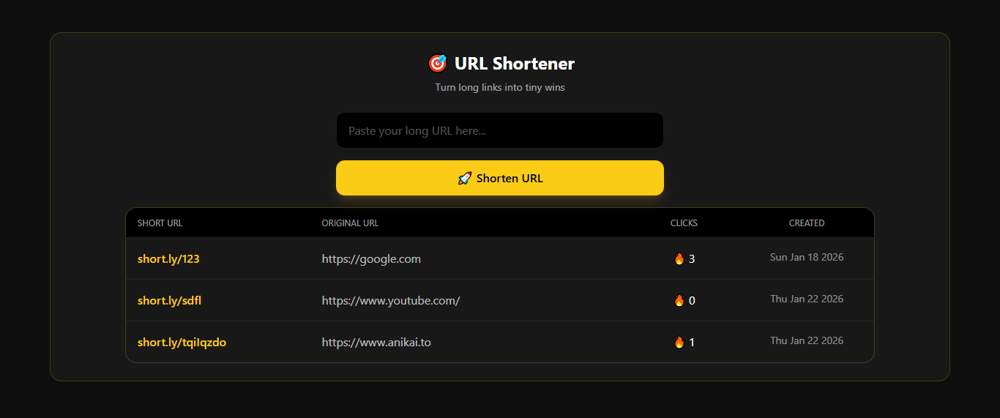

# URL Shortener 🎯🔗

A simple **URL shortener web application** built using **Node.js, Express, MongoDB, and EJS**, focused on understanding **backend fundamentals**, **database modeling**, and **real-world redirect logic**.

The project demonstrates how short links are generated, stored, tracked, and redirected — similar to services like Bitly, but built purely for **learning purposes**.

---

--- ## 📸 Screenshots 

---

## ⚙️ Tech Stack

### Backend 🧠

- Node.js
- Express.js
- MongoDB
- Mongoose
- Nanoid (random short ID generator)

### Frontend 🎨

- EJS (templating engine)
- Tailwind CSS (CDN-based)
- HTML

---

## ✨ Features

- 🔗 Generate short URLs from long links
- 🎲 Random short ID generation using Nanoid
- 🔁 Redirect short URL → original URL
- 📊 Click tracking using timestamps
- 📋 Dashboard to view all shortened URLs
- 🕒 Creation time tracking with MongoDB timestamps
- 🎮 Dark + gamified UI (yellow accent theme)

---

## 🧠 Learnings

The **main focus** of this project was to understand how **backend-driven applications** work in real-world scenarios.

Key concepts I learned:

- 🚏 **Express Routing**
  - Separating redirect routes and dashboard routes
  - Handling dynamic route parameters (`/:id`)
- 🗂️ **MongoDB & Mongoose**
  - Schema design for URL shorteners
  - Using `timestamps` for automatic date tracking
- 🔁 **Redirect Logic**
  - Counting clicks before redirecting users
  - Understanding how HTTP redirects work
- 📊 **Click Analytics**
  - Tracking visits using timestamp arrays
  - Calculating total clicks from visit history
- 🎲 **Unique ID Generation**
  - Using Nanoid instead of hardcoded or sequential IDs
- 🧩 **EJS Templating**
  - Rendering dynamic data
  - Looping over database results using EJS syntax
- 🔄 **POST → Redirect → GET pattern**
  - Preventing duplicate form submissions
- 🧱 Clean separation of concerns
  - Routes, database logic, views, and utilities

---
